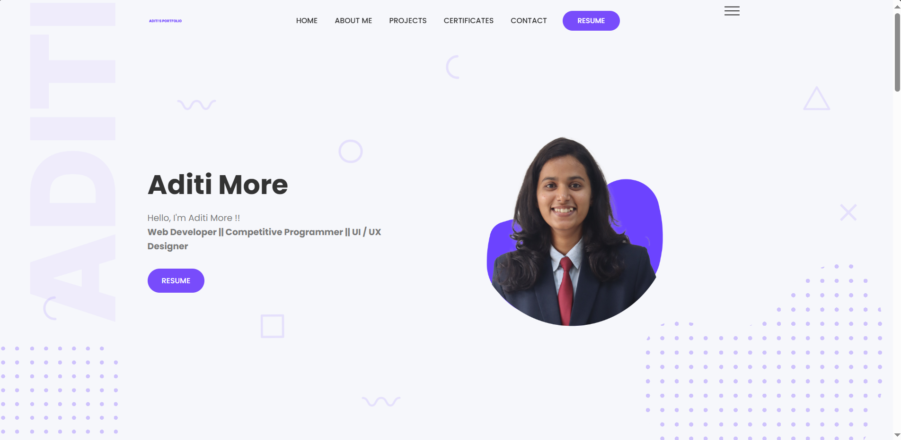
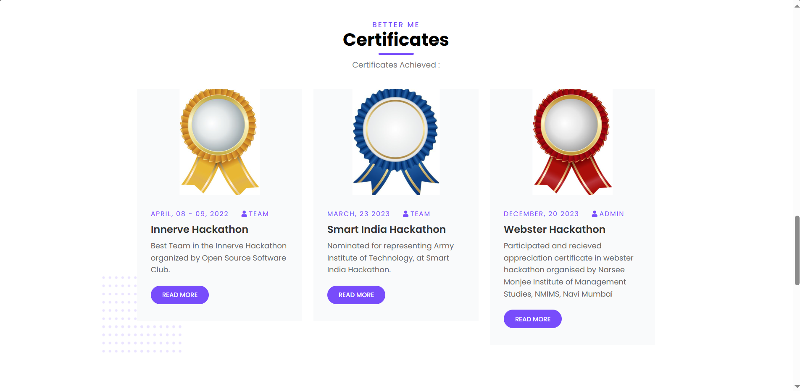
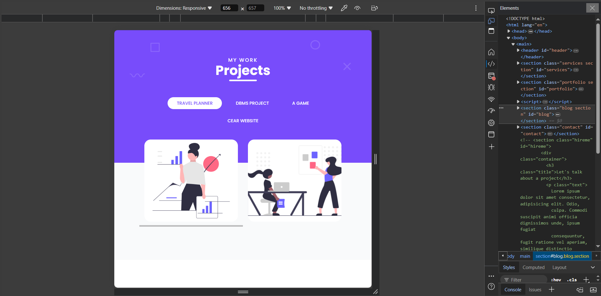

# Portfolio 
Here is my Personal Portfolio, which includes -  
1. Home Page
2. About Me
3. Projects
4. Certificates
5. Contact Details

## Tech Stacks used:

- HTML
- CSS
- JS

## Images:

- The images used are from [Pinterest](https://in.pinterest.com/)
- Illustrations from [Undraw](https://undraw.co/)
- Shapes and Icons from [Figma Community](https://www.figma.com/community)

## Overview:

- Here's the Snippet of the Landing Page of the Portfolio website:

- Certificate Section of the Portfolio:

- Tab view of the Portfolio (Responsive):

  
